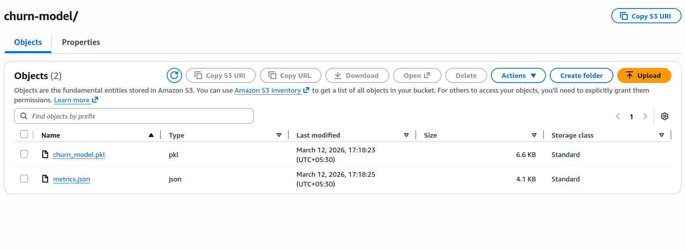

# S3 Upload Evidence


## 1) Upload Command Used

```bash
python -m src.cloud.s3_model_ops
```

## 2) Bucket Details

- Bucket: `shalom-churn-model-2026`
- Prefix: `churn-model`
- Region: `us-west-2`

## 3) Objects Expected in S3

- `churn_model.pkl`
- `metrics.json`

Expected path pattern:
- `s3://shalom-churn-model-2026/churn-model/churn_model.pkl`
- `s3://shalom-churn-model-2026/churn-model/metrics.json`


## 4) Verification Command

```bash
aws s3 ls s3://shalom-churn-model-2026/churn-model/
```

## 5) Verification Output

```text
2026-03-12 17:18:23       6733 churn_model.pkl
2026-03-12 17:18:25       4239 metrics.json
```

## 6) AWS Console Screenshot Evidence



Screenshot confirms:
- Prefix: `churn-model/`
- Object count: 2
- `churn_model.pkl` (6.6 KB, Standard)
- `metrics.json` (4.1 KB, Standard)
- Last modified around `2026-03-12 17:18` (UTC+05:30)
